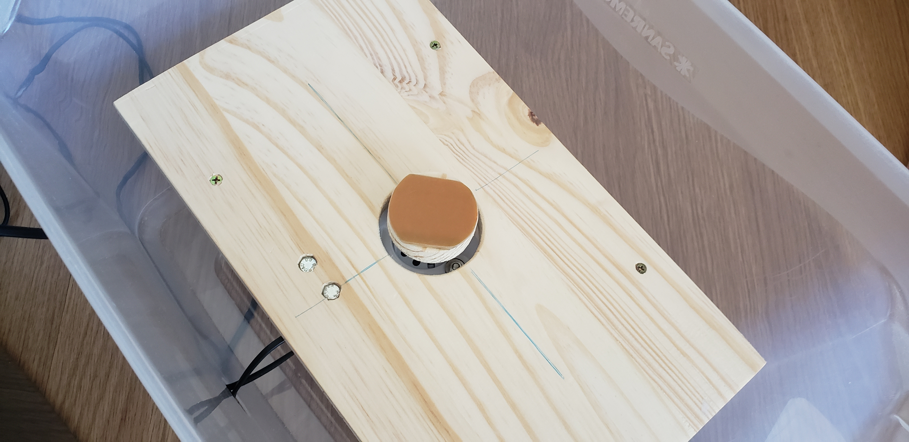

# PCB Factory

## Conceito do projeto
Printed circuit boards (PCBs) ou Placas de Circuito Impresso são componentes essenciais no design de circuitos eletrônicos estes que são importantes na cultura maker. Este documento é um tutorial de uso e explicação do processo de fabricação de um PCB caseiro com qualidade industrial.

O PCB Factory é um pacote que consiste em 2 componentes, um é a estação de tratamento de luz ultravioleta, e outra é a estação de centrifugação de placas.
  
## Pré-requisitos e recursos utilizados
Primeiramente foram utilizadas diversas fontes de conhecimento sobre o processod e manufatura de PCBs como:
1. [ezcontents](https://ezcontents.org/pcb-fabrication-part-1-dry-film)
2. [Youtube](https://www.youtube.com/watch?v=cRCFGZxmob0)
3. [Youtube](https://www.youtube.com/watch?v=1C3k6dyVN18)

Alem disso segue a lista de materiais usada para a criação do projeto:

- 2x Caixa de Plástico grande com tampa Removível
- 4x Esgana Gato
- 1x Secador de Cabelo Pequeno
- 1x Lâmpada de Luz Ultravioleta
- 1x Tabua de Madeira
- 1x Cabo de vassoura
- 1x Motor de Maquina de Costura
- Parafusos e Porcas
- 1x Soquete para lâmpada com fio
- 1x Lata de Tinta Preta

As ferramentas utilizadas foram

- Furadeira
- Serra
- Ferro de Solda
- Parafusadeira
  
## Passo a passo
1. Foram cortados dois pedaços de tabua de madeira um pouco menor do que o espaço interno da caixa.
2. Uma vassoura foi serrada para obter 8 pezinhos de madeira para suspender as tabuas dentro das caixas. Fixamos ambos juntos e na caixa por meio de parafusos.
3. Um limitador foi colocado no pedal do motor da maquina de costura
4. Foi furado um buraco no meio de umas das tabuas, assim possibilitando a fixação do motor de maquina de costura nessa mesma tábua.
5. O resto do buraco foi lixado até ser possivel encaixalo novamente com folga no mesmo buraco que foi tirado.
6. Utilizando 4 parafusos, este circulo restante foi fixado ao motor de maquina de costura
7. Dois buracos foram feitos na caixa para a fixação do secador de cabelo e a passagem dos cabos do motor.
8. Dois esgana gatos foram usados para fixar um dos lados da tampa a caixa, impedindo de abrir a caixa e deixar aberta.
9. Na outra caixa foi feito a mesma coisa com os pés de cabo de vassoura e tabua, contudo nenhum buraco foi feito na tabua.
10. Apenas um buraco foi feito na caixa para a fixação de um soquete de lampada.
11. Neste soquete foi fixado uma lampada de luz UV.
12. A caixa foi pintada de preto por dentro menos um pequeno buraco para indicar que a luz está funcionando.

## Execução
Lista de materiais para criação de uma PCB:
- Placa de Cobre do tamanho desejado para suportar o circuito.
- Modelo do circuito em qualquer software de design de circuitos eletrônicos.
- Tinta Fotossensível
- Papel Translucido
- Barrilha
- Soda Caustica
- Percloreto de Ferro, solução para corroer o cobre.
- Furador de PCB (Pode ser substituído por uma furadeira com broca pequena)

a) Imprima o design do circuito no papel translucido. Este papel sera utilizado como mascara no processo de cura. Geralmente a impressora deve possuir opção Ink Jet, o papel deve ser configurado como transparente ou então photo glossy. E a qualidade de impressão deve ser a maior possível (Melhor trocar tempo por qualidade neste caso); 
    
b) Lixe a placa de cobre e a limpe bem;
        
c) Insira a placa na estação de centrifugação. Coloque vários pedaços de fita dupla face na parte sem cobre da placa, limpe com álcool a base da centrifuga e então cole na base da estação de centrifugação;
        
d) Aplique uma camada de tinta fotossensível na placa de cobre, procure deixar uma maior concentração de tinta no centro da placa;
        
e) Feche e ligue a centrifuga por 90 segundos;

f) Ligue o secador da estação de centrifugação e deixe por 15 minutos, após este tempo deixe mais 10 minutos com a tampa aberta sem o secador ligado e repita este processo inteiro mais uma vez;

g) Retire da estação de centrifugação;

h) Coloque a mascara impressa em cima da placa coberta com a tinta, garanta que esta corretamente alinhada e fazendo contato direto com a superfície pintada; Para obter mais precisão pode ser inserida uma camada de papel transparente diretamente em cima da tinta, e então a camada com o máscara assim possibilitando manusear a máscara para alinhar perfeitamente.

i) Insira a placa na estação de luz ultravioleta pelo tempo especificado na tinta fotossensível. Ou no geral 4 minutos;

j) Misture 200 ml de agua com meia colher de Barrilha;

k) Insira a placa sem a mascara na solução misturada no passo anterior. Com um rolo de tinta pequeno, esfregue a placa gentilmente para retirar a tinta que não foi exposta a luz ultra violeta, deixando a superfície de cobre exposta
    
l) Reinsira a placa na estação de cura ultravioleta por mais 2 minutos;

m) Faça o mesmo processo do passo 11 porem com o percloreto de ferro. O percloreto de ferro vai corroer todo cobre exposto. Deixe no banho de percloreto por 10 minutos e mexa o percloreto durante o processo;

n) Lave a placa para limpar o percloreto de ferro com cuidado **PROCURE NAO JOGAR PERCLORETO EM NENHUMA TUBULAÇÃO!** O restante do percloreto pode ser colocado em uma garrafa e reutilizado na próxima pcb;
    
o) Ferva 200ml de agua e misture com 2 colheres de soda caustica. **CUIDADO NAO TOQUEM NA MISTURA**. Insira a placa nesta solução. Utilizando uma colher ou outra ferramenta, manuseie a placa para descolar a tinta ainda presente na mesma;

p) Com cuidado limpe novamente a placa com agua;

q) Faça a impressão de outra mascara, porem desta vez apenas com as ilhas de solda e com essa mascara alinhada as ilhas ja presentes na placa de cobre repita os passos 2 a 12 porem com a tinta fotossensível para mascara, e a cura na estação UV deve ser de apenas 30 segundos;
    
r) Corte e lixe a placa ate ficar do tamanho do circuito que foi impresso;

s) Utilizando um furador de PCB ou uma furadeira com a broca pequena, fure os buracos onde os componentes serão inseridos no caso de componentes com pontos de solda perfurados. No caso de componentes montados na superfície não ha necessidade de furacão;

t) Teste a placa utilizando um multímetro e o modo de teste de continuidade;

u) Dilua Breu em álcool isopropílico (No projeto entregue foi fornecido um concentrado de breu, dilua o concentrado em 3 partes de alcool para 1 de breu; Ou então faça uma mistura de 10 partes de álcool para 1 de breu em pó ) e então pingue nas ilhas de solda com um cotonete (ou passe na placa inteira, criando uma camada de verniz), isso ira formar uma camada anticorrosão também nas ilhas, que ira derreter quando for aplicado calor para solda.

v) Insira os componentes em seus lugares;

w) Solde os componentes;

## Bugs/problemas conhecidos
O projeto tem alguns riscos com materiais quimicos e também com a centrifuga, portanto é recomendado muito cuidado a operar.
Além disso o maior ponto de cuidado é a operação da centrifuga. Se a vibração da centrifuga for suficiente para mover a caixa, diminua a pressão no pedal

## Autor
* Leonardo Valerio Morales ([LeozeraVal](https://github.com/LeozeraVal))